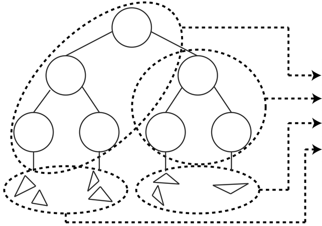
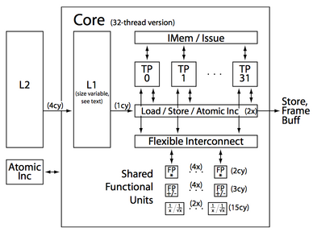

## Research

<a href="http://ieeexplore.ieee.org/document/8115176/"><strong>Time Interval Ray Tracing for Motion Blur</strong></a>
 
    IEEE Transactions on Visualization and Computer Graphics, 2017 
    <a href="http://www.cs.utah.edu/~kshkurko/">Konstantin Shkurko</a>,
    <a href="http://www.cemyuksel.com">Cem Yuksel</a>,
    <a href="http://www.cs.utah.edu/~dkopta">Daniel Kopta</a>,
    <a href="https://geometrian.com">Ian Mallet</a>,
    <a href="http://www.cs.utah.edu/~elb/">Erik Brunvand</a>
     
    <button onclick="toggle_visibility('TVCG17bib')"> BibTeX </button>

<pre>
@ARTICLE{8115176, 
author={K. Shkurko and C. Yuksel and D. Kopta and I. Mallett and E. Brunvand}, 
journal={IEEE Transactions on Visualization and Computer Graphics}, 
title={Time Interval Ray Tracing for Motion Blur}, 
year={2017}, 
volume={PP}, 
number={99}, 
pages={1-1}, 
keywords={Acceleration;Cameras;Dynamics;Geometry;Image reconstruction;Ray tracing;Strain;motion blur;ray tracing;sampling}, 
doi={10.1109/TVCG.2017.2775241}, 
ISSN={1077-2626}, 
month={},}
</pre>

 

<a href="papers/hwrt_igsc17.pdf"><strong>Power and Energy Implications of Misunderstanding DRAM</strong></a>
 
    International Green and Sustainable Computing Conference, 2017 
    <a href="http://www.cs.utah.edu/~elb/">Erik Brunvand</a> and
    <a href="http://www.cs.utah.edu/~dkopta">Daniel Kopta</a>
     
    [<a href="papers/hwrt_igsc17.pdf">pdf</a>]
    <button onclick="toggle_visibility('IGSC17bib')"> BibTeX </button>

<pre>
@InProceedings{brunvand-igsc-17,
  author =       {Erik Brunvand and Daniel Kopta},
  title =        {Power and Energy Implications of Misunderstanding DRAM},
  booktitle = {International Green and Sustainable Computing conference ({ISGC})},
  year =         2017,
  address =      {Orlando, Fl},
  organization = {{IEEE}},
  month =        {Oct.}}
</pre>

 

<a href="http://www.cs.utah.edu/~dkopta/papers/hwrt_hpg17.pdf"><strong>Dual Streaming for Hardware-Accelerated Ray Tracing</strong></a>
 
    High Performance Graphics, 2017 
    <a href="http://www.cs.utah.edu/~kshkurko/">Konstantin Shkurko</a>,
    <a href="http://www.cs.utah.edu/~tgrant/">Tim Grant</a>,
    <a href="http://www.cs.utah.edu/~dkopta">Daniel Kopta</a>,
    <a href="https://geometrian.com">Ian Mallet</a>,
    <a href="http://www.cemyuksel.com">Cem Yuksel</a>,
    <a href="http://www.cs.utah.edu/~elb/">Erik Brunvand</a>
     
    [<a href="http://www.cs.utah.edu/~dkopta/papers/hwrt_hpg17.pdf">author preprint</a>]
    <button onclick="toggle_visibility('HPG17bib')"> BibTeX </button>

 

<pre>
@inproceedings{Shkurko:2017:3105762.3105771,
 author = {Shkurko, Konstantin and Grant, Tim and Kopta, Daniel and Mallett, Ian and Yuksel, Cem and Brunvand, Erik},
 title = {Dual Streaming for Hardware-accelerated Ray Tracing},
 booktitle = {Proceedings of High Performance Graphics},
 series = {HPG '17},
 year = {2017},
 isbn = {978-1-4503-5101-0},
 location = {Los Angeles, California},
 pages = {12:1--12:11},
 articleno = {12},
 numpages = {11},
 url = {http://doi.acm.org/10.1145/3105762.3105771},
 doi = {10.1145/3105762.3105771},
 acmid = {3105771},
 publisher = {ACM},
 address = {New York, NY, USA},
 keywords = {raytracing hardware},
} 
</pre>

 

<a href="http://onlinelibrary.wiley.com/doi/10.1111/cgf.12458/abstract?systemMessage=Wiley+Online+Library+will+be+disrupted+9th+Aug+from+10-2+BST+for+essential+maintenance.+Pay+Per+View+will+be+unavailable+from+10-6+BST."><strong>Memory Considerations for Low Energy Ray Tracing</strong></a>
 
    Computer Graphics Forum, 2014 
    <a href="http://www.cs.utah.edu/~dkopta">Daniel Kopta</a>,
    <a href="http://www.cs.utah.edu/~kshkurko/">Konstantin Shkurko</a>,
    <a href="http://www.cs.utah.edu/~sjosef/">Josef Spjut</a>,
    <a href="http://www.cs.utah.edu/~elb/">Erik Brunvand</a>,
    <a href="http://www.cs.utah.edu/~ald/">Al Davis</a>
     
    [<a href="papers/hwrt_cgf14.pdf">author preprint</a>]
    [<a href="http://onlinelibrary.wiley.com/doi/10.1111/cgf.12458/abstract?systemMessage=Wiley+Online+Library+will+be+disrupted+9th+Aug+from+10-2+BST+for+essential+maintenance.+Pay+Per+View+will+be+unavailable+from+10-6+BST.">definitive version</a>]
    <button onclick="toggle_visibility('CGF14bib')"> BibTeX </button>

<pre>
@article {CGF:CGF12458,
author = {Kopta, D. and Shkurko, K. and Spjut, J. and Brunvand, E. and Davis, A.},
title = {Memory Considerations for Low Energy Ray Tracing},
journal = {Computer Graphics Forum},
issn = {1467-8659},
url = {http://dx.doi.org/10.1111/cgf.12458},
doi = {10.1111/cgf.12458},
pages = {n/a--n/a},
keywords = {architecture for accelerated graphics computing, hardware,
graphics hardware, ray casting/tracing hardware, 
I.3.1 [Computer Graphics]: Hardware Architecture&mdash;Parallel Processing;
I.3.7 [Computer Graphics]: Three-Dimensional Graphics and Realism&mdash;Raytracing},
year = {2014},
}
</pre>

 

<a href="http://s2014.siggraph.org/attendees/courses/events/why-graphics-programmers-need-know-about-dram.html"><strong>Why Graphics Programmers Need to Know About DRAM</strong></a>
 
    Course, ACM SIGGRAPH, 2014 
    <a href="http://www.cs.utah.edu/~elb/">Erik Brunvand</a>,
    <a href="http://www.cs.utah.edu/~dkopta">Daniel Kopta</a>,
    <a href="http://www.cs.utah.edu/~nil/">Niladrish Chatterjee</a>
     
    [<a href="papers/DRAM-SIGGRAPH14_post.pdf">slides</a>]

 

<a href="papers/hwrt_hpg13.pdf"><strong>An Energy and Bandwidth Efficient Ray Tracing Architecture</strong></a>
     
    High Performance Graphics, 2013 
    <a href="http://www.cs.utah.edu/~dkopta">Daniel Kopta</a>,
    <a href="http://www.cs.utah.edu/~kshkurko/">Konstantin Shkurko</a>,
    <a href="http://www.cs.utah.edu/~sjosef/">Josef Spjut</a>,
    <a href="http://www.cs.utah.edu/~elb/">Erik Brunvand</a>,
     <a href="http://www.cs.utah.edu/~ald/">Al Davis</a>
     
    [<a href="papers/hwrt_hpg13.pdf">pdf</a>]
    <button onclick="toggle_visibility('HPG13bib')"> BibTeX </button>

<pre>
@inproceedings{Kopta-HPG13,
 author = {Kopta, Daniel and Shkurko, Konstantin and Spjut, Josef and Brunvand, Erik and Davis, Al},
 title = {An Energy and Bandwidth Efficient Ray Tracing Architecture},
 booktitle = {Proceedings of the 5th High-Performance Graphics Conference},
 series = {HPG '13},
 year = {2013},
 isbn = {978-1-4503-2135-8},
 location = {Anaheim, California},
 pages = {121--128},
 numpages = {8},
 url = {http://doi.acm.org/10.1145/2492045.2492058},
 doi = {10.1145/2492045.2492058},
 acmid = {2492058},
 publisher = {ACM},
 address = {New York, NY, USA},
 keywords = {bandwidth reduction, energy reduction, persistent pipelines, ray tracing, streaming},
}
</pre>

 

<a href="http://www.cs.utah.edu/~thiago/papers/rotations.pdf"><strong>Fast, Effective BVH Updates for Animated Scenes</strong></a>
 
    ACM SIGGRAPH Symposium on Interactive 3D Graphics and Games, 2012 
    <a href="http://www.cs.utah.edu/~dkopta">Daniel Kopta</a>,
    <a href="http://www.cs.utah.edu/~thiago">Thiago Ize</a>,
    <a href="http://www.cs.utah.edu/~sjosef/">Josef Spjut</a>,
    <a href="http://www.cs.utah.edu/~elb/">Erik Brunvand</a>,
    <a href="http://www.cs.utah.edu/~ald/">Al Davis</a>,
    <a href="http://www.cs.utah.edu/~aek">Andrew Kensler</a>
     

    [<a href="http://www.cs.utah.edu/~thiago/papers/rotations.pdf">pdf</a>]
    [<a href="http://mantawiki.sci.utah.edu/manta/Main_Page">source code</a>]
    <button onclick="toggle_visibility('I3D12bib')"> BibTeX </button>

<pre>
@inproceedings{Kopta-I3D12,
 author = {Kopta, Daniel and Ize, Thiago and Spjut, Josef and Brunvand, Erik and Davis, Al and Kensler, Andrew},
 title = {Fast, Effective BVH Updates for Animated Scenes},
 booktitle = {Proceedings of the ACM SIGGRAPH Symposium on Interactive 3D Graphics and Games},
 series = {I3D '12},
 year = {2012},
 isbn = {978-1-4503-1194-6},
 location = {Costa Mesa, California},
 pages = {197--204},
 numpages = {8},
 url = {http://doi.acm.org/10.1145/2159616.2159649},
 doi = {10.1145/2159616.2159649},
 acmid = {2159649},
 publisher = {ACM},
 address = {New York, NY, USA},
 keywords = {acceleration structures, bounding volume hierarchies, dynamic scenes, parallel update, ray tracing, tree rotations},
} 
</pre>

 

<a href="http://www.cs.utah.edu/~sjosef/papers/spjut-shaw12-final.pdf"> <strong>A Mobile Accelerator Architecture for Ray Tracing</strong></a>
 
    Workshop on SoCs, Heterogeneous Architectures and Workloads, 2012 
    <a href="http://www.cs.utah.edu/~sjosef/">Josef Spjut</a>,
    <a href="http://www.cs.utah.edu/~dkopta">Daniel Kopta</a>,
    <a href="http://www.cs.utah.edu/~elb/">Erik Brunvand</a>,
    <a href="http://www.cs.utah.edu/~ald/">Al Davis</a>
     

    [<a href="http://www.cs.utah.edu/~sjosef/papers/spjut-shaw12-final.pdf">pdf</a>]
    <button onclick="toggle_visibility('SHAW12bib')"> BibTeX </button>

<pre>
@InProceedings{Spjut-SHAW12,
  author =   {Josef Spjut and Daniel Kopta and Erik Brunvand and Al Davis},
  title =    {A Mobile Accelerator Architecture for Ray Tracing},
  booktitle =    {3rd Workshop on SoCs, Heterogeneous Architectures and Workloads (SHAW-3)},
  year =     2012,
}
</pre>

 

<a href="papers/hwrt_iccd10.pdf"><strong>Efficient MIMD Architectures for High-Performance Ray Tracing</strong></a>
 
    IEEE International Conference on Computer Design, 2010 
    <a href="http://www.cs.utah.edu/~dkopta">Daniel Kopta</a>,
    <a href="http://www.cs.utah.edu/~sjosef/">Josef Spjut</a>,
    <a href="http://www.cs.utah.edu/~elb/">Erik Brunvand</a>,
     <a href="http://www.cs.utah.edu/~ald/">Al Davis</a>
     

    [<a href="papers/hwrt_iccd10.pdf">pdf</a>]
    <button onclick="toggle_visibility('ICCD10bib')"> BibTeX </button>

<pre>
@INPROCEEDINGS{Kopta-ICCD10,
author={Daniel Kopta and Josef Spjut and Erik Brunvand and Alan Davis},
booktitle={IEEE International Conference on Computer Design (ICCD)},
title={Efficient {MIMD} architectures for high-performance ray tracing},
year={2010},
}
</pre>

 

<a href="papers/hwrt_tcad09.pdf"><strong>TRaX: A Multicore Hardware Architecture for Real-Time Ray Tracing</strong> </a>
 
    Transactions on Computer Aided Design 2009 
    <a href="http://www.cs.utah.edu/~sjosef/">Josef Spjut</a>,
    <a href="http://www.cs.utah.edu/~aek/">Andrew Kensler</a>,
    <a href="http://www.cs.utah.edu/~dkopta">Daniel Kopta</a>,
    <a href="http://www.cs.utah.edu/~elb/">Erik Brunvand</a>
     

    [<a href="papers/hwrt_tcad09.pdf">pdf</a>]
    <button onclick="toggle_visibility('TCAD09bib')"> BibTeX </button>

<pre>
@article{Spjut-TCAD09,
 author = {Spjut, Josef and Kensler, Andrew and Kopta, Daniel and Brunvand, Erik},
 title = {TRaX: A Multicore Hardware Architecture for Real-time Ray Tracing},
 journal = {Trans. Comp.-Aided Des. Integ. Cir. Sys.},
 issue_date = {December 2009},
 volume = {28},
 number = {12},
 month = dec,
 year = {2009},
 issn = {0278-0070},
 pages = {1802--1815},
 numpages = {14},
 url = {http://dx.doi.org/10.1109/TCAD.2009.2028981},
 doi = {10.1109/TCAD.2009.2028981},
 acmid = {1721250},
 publisher = {IEEE Press},
 address = {Piscataway, NJ, USA},
 keywords = {Computer architecture, computer architecture, computer graphics, ray tracing},
}
</pre>

 

<a href="papers/hwrt_sasp08.pdf"><strong>TRaX: A Multi-Threaded Architecture for Real-Time Ray Tracing</strong> </a>
 
    *Best paper award  
    IEEE Symposium on Application Specific Processors, 2008 
    <a href="http://www.cs.utah.edu/~sjosef/">Josef Spjut</a>,
    <a href="http://graphics.stanford.edu/~boulos/">Solomon Boulos</a>,
    <a href="http://www.cs.utah.edu/~dkopta">Daniel Kopta</a>,
    <a href="http://www.cs.utah.edu/~elb/">Erik Brunvand</a>,
    <a href="http://www.ece.utah.edu/~skellis/">Spencer Kellis</a>
     
    [<a href="papers/hwrt_sasp08.pdf">pdf</a>]
    <button onclick="toggle_visibility('SASP08bib')"> BibTeX </button>

<pre>
@inproceedings{Spjut-SASP08,
 author = {Spjut, Josef and Boulos, Solomon and Kopta, Daniel and Brunvand, Erik and Kellis, Spencer},
 title = {TRaX: A Multi-Threaded Architecture for Real-Time Ray Tracing},
 booktitle = {Proceedings of the 2008 Symposium on Application Specific Processors},
 series = {SASP '08},
 year = {2008},
 isbn = {978-1-4244-2333-0},
 pages = {108--114},
 numpages = {7},
 url = {http://dx.doi.org/10.1109/SASP.2008.4570794},
 doi = {10.1109/SASP.2008.4570794},
 acmid = {1549691},
 publisher = {IEEE Computer Society},
 address = {Washington, DC, USA},
}
</pre>

 

<h2>Dissertation</h2>

<a href="papers/kopta_dissertation.pdf"> <strong>Ray Tracing From a Data Movement Perspective</strong></a>
     University of Utah Ph.D. Dissertation 
    [<a href="papers/kopta_dissertation.pdf">pdf</a>]
    <button onclick="toggle_visibility('DISSERTATIONbib')"> BibTeX </button>

<pre>
@phdthesis{Kopta-thesis16,
author = {Daniel Kopta},
title = {Ray Tracing From a Data Movement Perspective},
school = {The University of Utah},
year = {2016},
month = {May}
}
</pre>

